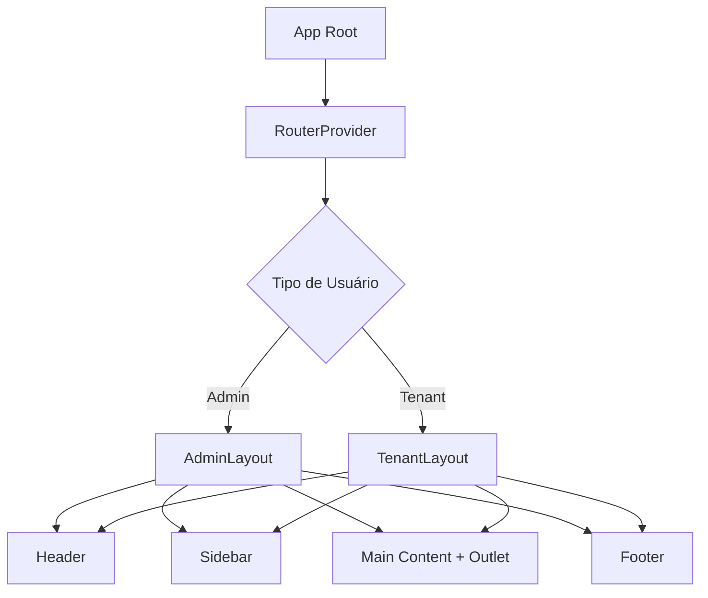

# 🏗️ GUIA COMPLETO: RECONSTRUÇÃO DE TEMPLATE E LAYOUT WEB vs MOBILE

## DiixWhatsApp Frontend - Sistema de Layout Responsivo

**Versão:** 2.0.0  
**Data:** Dezembro 2024  
**Tema:** Cyberpunk Futurista Premium

---

## 📋 ÍNDICE

1. [Visão Geral da Arquitetura](#1-visão-geral-da-arquitetura)
2. [Estrutura de Componentes de Layout](#2-estrutura-de-componentes-de-layout)
3. [Design Tokens e Sistema de Cores](#3-design-tokens-e-sistema-de-cores)
4. [Layout Web (Desktop)](#4-layout-web-desktop)
5. [Layout Mobile](#5-layout-mobile)
6. [Implementação Passo a Passo](#6-implementação-passo-a-passo)
7. [Checklist de Validação](#7-checklist-de-validação)
8. [Código Base para Recriação](#8-código-base-para-recriação)

---

## 1. VISÃO GERAL DA ARQUITETURA

### 1.1 Hierarquia de Componentes

```
App
├── RouterProvider
│   ├── Admin Routes
│   │   └── AdminLayout
│   │       ├── Header
│   │       │   ├── Menu Toggle
│   │       │   ├── Search Bar
│   │       │   ├── ThemeToggle
│   │       │   ├── NotificationBell
│   │       │   └── UserMenu
│   │       ├── Sidebar
│   │       │   ├── Logo
│   │       │   ├── Navigation (com submenus)
│   │       │   └── User Profile
│   │       ├── Main Content (Outlet)
│   │       └── Footer
│   └── Tenant Routes
│       └── TenantLayout (mesma estrutura)
```

### 1.2 Fluxo de Renderização



### 1.3 Pontos de Decisão de Layout

| Breakpoint | Tipo | Comportamento |
|------------|------|---------------|
| `< 640px` | Mobile Extra Pequeno | Sidebar overlay, header simplificado |
| `640px - 768px` | Mobile Grande | Sidebar overlay, header completo |
| `768px - 1024px` | Tablet | Sidebar colapsável, header completo |
| `> 1024px` | Desktop | Sidebar fixa expandida, header completo |

---

## 2. ESTRUTURA DE COMPONENTES DE LAYOUT

### 2.1 Componente Principal: AdminLayout.tsx / TenantLayout.tsx

**Função:** Wrapper principal que gerencia sidebar, header, content e footer

**Estrutura:**
```tsx
<div className="min-h-screen bg-background">
  {/* Background animado */}
  <div className="fixed inset-0 bg-animated-gradient -z-10" />
  
  {/* Sidebar Fixa */}
  <motion.aside className="fixed left-0 top-0 z-40 h-screen w-72">
    {/* Logo */}
    {/* Navegação */}
    {/* Perfil do Usuário */}
  </motion.aside>
  
  {/* Conteúdo Principal */}
  <div className={`transition-all duration-300 ${sidebarOpen ? 'ml-72' : 'ml-0'}`}>
    {/* Header */}
    <Header onMenuClick={...} isSidebarOpen={...} />
    
    {/* Página Atual */}
    <main className="flex flex-col min-h-screen p-6">
      <Outlet />
      <Footer />
    </main>
  </div>
</div>
```

**Responsabilidades:**
- ✅ Gerenciar estado da sidebar (`sidebarOpen`)
- ✅ Gerenciar menus expansíveis (`expandedMenus`)
- ✅ Fornecer contexto de usuário
- ✅ Controlar navegação entre rotas
- ✅ Aplicar animações de transição

### 2.2 Header.tsx - Barra Superior

**Estrutura:**
```tsx
<header className="sticky top-0 z-30 glass-panel border-b border-white/10">
  <div className="flex items-center justify-between px-4 sm:px-6 py-3 sm:py-4">
    
    {/* Lado Esquerdo */}
    <div className="flex items-center gap-3 sm:gap-4">
      <Button onClick={onMenuClick}> {/* Menu Toggle */} </Button>
      <h1>{title}</h1> {/* Título da Página */}
    </div>
    
    {/* Lado Direito */}
    <div className="flex items-center gap-2 sm:gap-4">
      <SearchBar /> {/* Hidden em mobile pequeno */}
      <ThemeToggle />
      <NotificationBell />
      <DateDisplay /> {/* Hidden em mobile */}
      <UserMenu />
    </div>
  </div>
</header>
```

**Elementos por breakpoint:**

| Elemento | xs (<640px) | sm (640-768px) | md (768-1024px) | lg (>1024px) |
|----------|-------------|----------------|-----------------|--------------|
| Menu Toggle | ✅ | ✅ | ✅ | ✅ |
| Título | ❌ | ✅ | ✅ | ✅ |
| Search Bar | ❌ | ❌ | ✅ | ✅ |
| Theme Toggle | ✅ | ✅ | ✅ | ✅ |
| Notificações | ✅ | ✅ | ✅ | ✅ |
| Data | ❌ | ❌ | ❌ | ✅ |
| User Menu | ✅ | ✅ | ✅ | ✅ |

### 2.3 Sidebar.tsx - Navegação Lateral

**Estrutura:**
```tsx
<motion.aside
  initial={{ x: -300 }}
  animate={{ x: sidebarOpen ? 0 : -300 }}
  transition={{ type: 'spring', damping: 25, stiffness: 200 }}
  className="fixed left-0 top-0 z-40 h-screen w-72 glass-panel"
>
  {/* Logo Section */}
  <div className="p-6 border-b border-white/10">
    <Link to="/">
      <Logo />
      <BrandName />
    </Link>
  </div>
  
  {/* Navigation */}
  <nav className="flex-1 p-4 space-y-2 overflow-y-auto">
    {navigation.map(item => (
      item.children ? (
        // Item com submenu
        <div>
          <button onClick={() => toggleMenu(item.name)}>
            <item.icon />
            <span>{item.name}</span>
            <ChevronDown/ChevronRight />
          </button>
          {isExpanded && (
            <motion.div>
              {item.children.map(child => (
                <Link to={child.href}>{child.name}</Link>
              ))}
            </motion.div>
          )}
        </div>
      ) : (
        // Item simples
        <Link to={item.href}>
          <item.icon />
          <span>{item.name}</span>
        </Link>
      )
    ))}
  </nav>
  
  {/* User Profile */}
  <div className="p-4 border-t border-white/10">
    <UserCard />
    <LogoutButton />
  </div>
</motion.aside>
```

**Comportamento Responsivo:**

| Estado | Desktop (>1024px) | Tablet (768-1024px) | Mobile (<768px) |
|--------|-------------------|---------------------|-----------------|
| Inicial | Expandida | Colapsada | Colapsada |
| Ao abrir | Desloca conteúdo | Overlay | Overlay |
| Backdrop | ❌ | ✅ | ✅ |
| Width | 288px (w-72) | 288px (w-72) | 100% ou 288px |

### 2.4 Footer.tsx - Rodapé

**Estrutura:**
```tsx
<footer className="glass-panel border-t border-white/10 px-4 sm:px-6 py-4 sm:py-6 mt-auto">
  <div className="max-w-7xl mx-auto">
    <div className="flex flex-col sm:flex-row items-center justify-between gap-4">
      
      {/* Copyright + Version */}
      <div className="flex items-center gap-2 sm:gap-4">
        <p>© {year} DIIX WhatsApp Frontend</p>
        <span className="hidden sm:inline">v{version}</span>
      </div>
      
      {/* Quick Links */}
      <nav className="flex items-center gap-4 sm:gap-6">
        <a href="/terms">Termos</a>
        <a href="/privacy">Privacidade</a>
        <a href="/support">Suporte</a>
      </nav>
      
      {/* Social Links */}
      <div className="flex items-center gap-3">
        <a>Github</a>
        <a>LinkedIn</a>
        <a>Twitter</a>
        <a>Email</a>
      </div>
    </div>
    
    {/* Contact Info */}
    <div className="mt-4 pt-4 border-t">
      <p>Precisa de ajuda? suporte@diix.com.br</p>
    </div>
  </div>
</footer>
```

**Simplificação Mobile:**
```tsx
// Mobile (< 640px): Mostrar apenas copyright
<footer className="md:hidden">
  <p className="text-xs text-center">© {year} DIIX. Todos os direitos reservados.</p>
</footer>
```

---

## 3. DESIGN TOKENS E SISTEMA DE CORES

### 3.1 Variáveis CSS Principais (tokens.css)

```css
:root {
  /* Cores de Fundo - Deep Space */
  --bg-primary: #030305;
  --bg-secondary: #0f0f12;
  --bg-tertiary: #16161a;
  
  /* Cores de Texto */
  --text-primary: #ffffff;
  --text-secondary: #e0e0ff;
  --text-muted: #8888aa;
  
  /* Accent Colors - Neon Cyberpunk */
  --accent-primary: #00ff9d;      /* Cyber Green */
  --accent-secondary: #ff00ff;    /* Magenta */
  --accent-cyan: #00ffff;         /* Cyan */
  
  /* Bordas */
  --border-default: rgba(255, 255, 255, 0.08);
  --border-focus: rgba(0, 255, 157, 0.5);
  
  /* Glassmorphism */
  --glass-bg: rgba(255, 255, 255, 0.03);
  --glass-border: rgba(255, 255, 255, 0.1);
  --glass-shadow: 0 8px 32px 0 rgba(0, 0, 0, 0.37);
  
  /* Spacing */
  --space-4: 1rem;      /* 16px */
  --space-6: 1.5rem;    /* 24px */
  --space-8: 2rem;      /* 32px */
  
  /* Typography */
  --font-family-sans: 'Inter', system-ui, sans-serif;
  --text-base: clamp(1rem, 0.9rem + 0.5vw, 1.125rem);
}
```

### 3.2 Configuração Tailwind (tailwind.config.js)

```javascript
export default {
  content: ["./index.html", "./src/**/*.{js,ts,jsx,tsx}"],
  theme: {
    extend: {
      colors: {
        background: {
          DEFAULT: '#050505',
          light: '#121212',
        },
        accent: {
          primary: '#00ff9d',
          secondary: '#bd00ff',
          cyan: '#00f3ff',
        },
        text: {
          primary: '#ffffff',
          secondary: '#e0e0e0',
          muted: '#a0a0a0',
        },
        error: '#ff4d4d',
      },
      fontFamily: {
        sans: ['Inter', 'system-ui', 'sans-serif'],
      },
      boxShadow: {
        'neon-green': '0 0 20px rgba(0, 255, 157, 0.15)',
        'glass': '0 8px 32px 0 rgba(0, 0, 0, 0.37)',
      },
      animation: {
        'gradient': 'gradient 15s ease infinite',
        'float': 'float 6s ease-in-out infinite',
      },
    },
  },
  plugins: [],
}
```

### 3.3 Classes Utilitárias Personalizadas (globals.css)

```css
@layer components {
  /* Glassmorphism Effects */
  .glass-card {
    @apply backdrop-blur-xl;
    background: var(--glass-bg);
    border: 1px solid var(--glass-border);
    box-shadow: var(--glass-shadow);
  }
  
  .glass-panel {
    @apply backdrop-blur-xl;
    background: rgba(255, 255, 255, 0.02);
    border: 1px solid rgba(255, 255, 255, 0.08);
  }
  
  /* Neon Glow Effects */
  .neon-glow-green {
    box-shadow: 0 0 20px rgba(0, 255, 157, 0.5);
  }
  
  /* Animated Gradient Background */
  .bg-animated-gradient {
    background: linear-gradient(-45deg, #030305, #0a0a12, #0f0f1a, #12121f);
    background-size: 400% 400%;
    animation: gradient 15s ease infinite;
  }
  
  /* Custom Scrollbar */
  .scrollbar-thin::-webkit-scrollbar {
    width: 8px;
    height: 8px;
  }
  
  .scrollbar-thin::-webkit-scrollbar-thumb {
    background: linear-gradient(180deg, #00ff9d, #00ffff);
    border-radius: 4px;
  }
}
```

---

## 4. LAYOUT WEB (DESKTOP)

### 4.1 Estrutura Visual Desktop (> 1024px)

```
┌─────────────────────────────────────────────────────────────┐
│ HEADER (fixo, 64px altura)                                  │
│ ┌─────────────────────────────────────────────────────┐    │
│ │ ☰ Menu  │  Título da Página           🔔 👤        │    │
│ └─────────────────────────────────────────────────────┘    │
├─────────┬───────────────────────────────────────────────────┤
│         │                                                   │
│ SIDEBAR │  MAIN CONTENT                                     │
│ (fixa,  │  • Stats Cards                                    │
│ 288px)  │  • Gráficos                                       │
│         │  • Tabelas                                        │
│ • Logo  │  • Formulários                                    │
│ • Menu  │                                                   │
│ • User  │                                                   │
│         │                                                   │
│         ├───────────────────────────────────────────────────┤
│         │ FOOTER                                            │
│         │ © 2024 DIIX | Termos | Privacidade | Social      │
└─────────┴───────────────────────────────────────────────────┘
```

### 4.2 Medidas Desktop

| Elemento | Largura | Altura | Margens |
|----------|---------|--------|---------|
| Header | 100% - 288px | 64px (sm:py-4) | ml-72 |
| Sidebar | 288px (w-72) | 100vh | fixed left-0 |
| Content | 100% restante | auto | p-6 |
| Footer | 100% | auto (conteúdo) | mt-auto |

### 4.3 Comportamentos Desktop

**Sidebar:**
- Sempre visível (expandida por padrão)
- Fixa na esquerda
- Scroll independente para navegação
- Hover effects com transição suave

**Header:**
- Sticky no topo
- Contém todos os elementos (search, date, notifications, user)
- Blur backdrop ao rolar

**Content:**
- Margem esquerda de 288px (quando sidebar aberta)
- Padding generoso (p-6 = 24px)
- Animações de entrada por página

**Footer:**
- Empurrado para baixo com `mt-auto`
- Todos os elementos visíveis
- Links sociais completos

---

## 5. LAYOUT MOBILE

### 5.1 Estrutura Visual Mobile (< 640px)

```
┌─────────────────────────────────────┐
│ HEADER (fixo, 56px altura)          │
│ ┌─────────────────────────────┐    │
│ │ ☰  │  (título oculto)    👤 │    │
│ └─────────────────────────────┘    │
├─────────────────────────────────────┤
│                                     │
│ MAIN CONTENT                        │
│ • Stats Cards (stack vertical)     │
│ • Gráficos (responsivos)           │
│ • Tabelas (scroll horizontal)      │
│ • Formulários (full width)         │
│                                     │
│                                     │
├─────────────────────────────────────┤
│ FOOTER (simplificado)               │
│ © 2024 DIIX. Todos os direitos.    │
└─────────────────────────────────────┘

OVERLAY (quando sidebar abre):
┌─────────────────────────────────────┐
│ ╔════════╗                          │
│ ║ SIDEBAR║ (overlay, 100% altura)  │
│ ║ (100%  ║  • Logo                  │
│ ║  ou    ║  • Menu (scroll)         │
│ ║ 288px) ║  • User + Logout         │
│ ╚════════╝                          │
│ ░░░░░░░░░ Backdrop (50% opacity)   │
└─────────────────────────────────────┘
```

### 5.2 Medidas Mobile

| Elemento | Largura | Altura | Comportamento |
|----------|---------|--------|---------------|
| Header | 100% | 56px (py-3) | Fixo, elementos essenciais |
| Sidebar | 100% ou 288px | 100vh | Overlay com backdrop |
| Content | 100% | auto | Full width, padding reduzido |
| Footer | 100% | auto | Simplificado, copyright apenas |

### 5.3 Comportamentos Mobile

**Sidebar:**
- Oculta por padrão
- Abre como overlay (não desloca conteúdo)
- Backdrop escuro (50% opacity)
- Fecha ao clicar fora ou no botão X
- Touch targets de 44px mínimo

**Header:**
- Elementos priorizados: Menu Toggle, User Menu
- Search hidden (ou em modal separado)
- Date hidden
- Notificações mantidas (ícone apenas)

**Content:**
- Sem margem lateral (sidebar é overlay)
- Padding reduzido (p-4 = 16px)
- Cards empilhados verticalmente
- Tabelas com scroll horizontal

**Footer:**
- Versão simplificada (copyright apenas)
- Links sociais removidos ou em menu hamburger
- Contact info removida

---

## 6. IMPLEMENTAÇÃO PASSO A PASSO

### Passo 1: Configurar Design Tokens

**Arquivo:** `src/styles/tokens.css`

```css
/* Copiar tokens.css completo do projeto */
/* Inclui: cores, spacing, typography, breakpoints */
```

### Passo 2: Configurar Tailwind

**Arquivo:** `tailwind.config.js`

```javascript
export default {
  content: ["./index.html", "./src/**/*.{js,ts,jsx,tsx}"],
  theme: {
    extend: {
      colors: {
        background: { DEFAULT: '#050505', light: '#121212' },
        accent: { primary: '#00ff9d', secondary: '#bd00ff', cyan: '#00f3ff' },
        text: { primary: '#ffffff', secondary: '#e0e0e0', muted: '#a0a0a0' },
        error: '#ff4d4d',
      },
      fontFamily: { sans: ['Inter', 'system-ui', 'sans-serif'] },
      boxShadow: {
        'neon-green': '0 0 20px rgba(0, 255, 157, 0.15)',
        'glass': '0 8px 32px 0 rgba(0, 0, 0, 0.37)',
      },
    },
  },
}
```

### Passo 3: Criar Estilos Globais

**Arquivo:** `src/index.css` ou `src/styles/globals.css`

```css
@import url('https://fonts.googleapis.com/css2?family=Inter:wght@300;400;500;600;700;800;900&display=swap');
@import './tokens.css';

@tailwind base;
@tailwind components;
@tailwind utilities;

@layer base {
  body {
    @apply text-text-primary font-sans antialiased;
    background: linear-gradient(135deg, #030305 0%, #0a0a12 50%, #0f0f1a 100%);
    min-height: 100vh;
  }
}

@layer components {
  .glass-card { /* ... */ }
  .glass-panel { /* ... */ }
  .bg-animated-gradient { /* ... */ }
  .neon-glow-green { /* ... */ }
}
```

### Passo 4: Criar Componente Header

**Arquivo:** `src/components/layout/Header.tsx`

```tsx
import { useState, useEffect } from 'react'
import { motion } from 'framer-motion'
import { Menu, X, Search } from 'lucide-react'
import { cn } from '@/lib/utils'
import { Button } from '@/components/ui/Button'
import { ThemeToggle } from '@/components/ui/ThemeToggle'
import { NotificationBell } from '@/components/notifications/NotificationBell'
import { UserMenu } from './UserMenu'

interface HeaderProps {
  onMenuClick: () => void;
  isSidebarOpen: boolean;
  title?: string;
  user?: any | null;
  onLogout?: () => void;
}

export default function Header({ onMenuClick, isSidebarOpen, title, user, onLogout }: HeaderProps) {
  const [isMobile, setIsMobile] = useState(false)

  useEffect(() => {
    const checkMobile = () => setIsMobile(window.innerWidth < 1024)
    checkMobile()
    window.addEventListener('resize', checkMobile)
    return () => window.removeEventListener('resize', checkMobile)
  }, [])

  return (
    <header className={cn(
      "sticky top-0 z-30 glass-panel border-b border-white/10 backdrop-blur-xl",
      "transition-all duration-300"
    )}>
      <div className="flex items-center justify-between px-4 sm:px-6 py-3 sm:py-4">
        
        {/* Left side */}
        <div className="flex items-center gap-3 sm:gap-4">
          <Button
            variant="ghost"
            size="sm"
            onClick={onMenuClick}
            className="min-h-[44px] min-w-[44px] p-2"
            aria-label={isSidebarOpen ? 'Fechar menu' : 'Abrir menu'}
          >
            {isSidebarOpen && !isMobile ? <X className="w-5 h-5" /> : <Menu className="w-5 h-5" />}
          </Button>
          
          {title && (
            <h1 className="text-base sm:text-xl font-bold text-text-primary hidden sm:block">
              {title}
            </h1>
          )}
        </div>

        {/* Right side */}
        <div className="flex items-center gap-2 sm:gap-4">
          {/* Search - hidden on mobile */}
          <div className="hidden md:flex items-center">
            <div className="relative">
              <Search className="absolute left-3 top-1/2 -translate-y-1/2 w-4 h-4 text-text-muted" />
              <input
                type="text"
                placeholder="Buscar..."
                className="pl-10 pr-4 py-2 rounded-lg bg-white/5 border border-white/10 text-sm min-h-[44px]"
              />
            </div>
          </div>

          <ThemeToggle variant="icon" size="sm" />
          <NotificationBell notifications={[]} />
          <span className="hidden lg:block text-sm text-text-muted">
            {new Date().toLocaleDateString('pt-BR')}
          </span>
          <UserMenu user={user} onLogout={onLogout} />
        </div>
      </div>
    </header>
  )
}
```

### Passo 5: Criar Componente Sidebar

**Arquivo:** `src/components/layout/Sidebar.tsx` (ou inline no Layout)

```tsx
import { useState } from 'react'
import { Link, useLocation } from 'react-router-dom'
import { motion, AnimatePresence } from 'framer-motion'
import { ChevronDown, ChevronRight, LogOut } from 'lucide-react'

interface NavItem {
  name: string;
  href: string;
  icon: React.ElementType;
  children?: { name: string; href: string }[];
}

const navigation: NavItem[] = [
  { name: 'Dashboard', href: '/admin', icon: LayoutDashboard },
  { name: 'Tenants', href: '/admin/tenants', icon: Building2 },
  // ... mais itens
]

export default function Sidebar({ isOpen, onClose }: { isOpen: boolean; onClose: () => void }) {
  const [expandedMenus, setExpandedMenus] = useState<string[]>(['Histórico'])
  const location = useLocation()

  const toggleMenu = (menuName: string) => {
    setExpandedMenus(prev => 
      prev.includes(menuName) ? prev.filter(n => n !== menuName) : [...prev, menuName]
    )
  }

  return (
    <>
      {/* Backdrop para mobile */}
      {isOpen && (
        <div 
          className="fixed inset-0 bg-black/50 z-30 lg:hidden"
          onClick={onClose}
        />
      )}
      
      <motion.aside
        initial={{ x: -300 }}
        animate={{ x: isOpen ? 0 : -300 }}
        transition={{ type: 'spring', damping: 25, stiffness: 200 }}
        className="fixed left-0 top-0 z-40 h-screen w-72 glass-panel border-r border-white/10"
      >
        <div className="flex flex-col h-full">
          {/* Logo */}
          <div className="p-6 border-b border-white/10">
            <Link to="/" className="flex items-center gap-3">
              <div className="w-10 h-10 rounded-xl bg-gradient-to-br from-accent-primary to-accent-cyan flex items-center justify-center neon-glow-green">
                <Shield className="w-6 h-6 text-black" />
              </div>
              <div>
                <h1 className="text-xl font-bold text-text-primary">DiixWhatsApp</h1>
                <p className="text-xs text-text-muted">Admin Panel</p>
              </div>
            </Link>
          </div>

          {/* Navigation */}
          <nav className="flex-1 p-4 space-y-2 overflow-y-auto scrollbar-thin">
            {navigation.map((item) => {
              const isActive = location.pathname === item.href
              const isExpanded = expandedMenus.includes(item.name)
              
              if (item.children) {
                return (
                  <div key={item.name} className="space-y-1">
                    <button
                      onClick={() => toggleMenu(item.name)}
                      className={`w-full flex items-center justify-between px-4 py-3 rounded-lg ${
                        isActive ? 'bg-accent-primary/10 text-accent-primary' : 'text-text-secondary hover:bg-white/5'
                      }`}
                    >
                      <div className="flex items-center gap-3">
                        <item.icon className="w-5 h-5" />
                        <span className="font-medium">{item.name}</span>
                      </div>
                      {isExpanded ? <ChevronDown className="w-4 h-4" /> : <ChevronRight className="w-4 h-4" />}
                    </button>
                    
                    <AnimatePresence>
                      {isExpanded && (
                        <motion.div
                          initial={{ opacity: 0, height: 0 }}
                          animate={{ opacity: 1, height: 'auto' }}
                          exit={{ opacity: 0, height: 0 }}
                          className="ml-4 pl-4 border-l border-white/10 space-y-1"
                        >
                          {item.children.map((child) => (
                            <Link
                              key={child.name}
                              to={child.href}
                              className={`block px-4 py-2 rounded-lg text-sm ${
                                location.pathname === child.href ? 'text-accent-primary bg-accent-primary/5' : 'text-text-muted hover:text-text-primary'
                              }`}
                            >
                              {child.name}
                            </Link>
                          ))}
                        </motion.div>
                      )}
                    </AnimatePresence>
                  </div>
                )
              }
              
              return (
                <Link
                  key={item.name}
                  to={item.href}
                  className={`flex items-center gap-3 px-4 py-3 rounded-lg ${
                    isActive ? 'bg-accent-primary/10 text-accent-primary' : 'text-text-secondary hover:bg-white/5'
                  }`}
                >
                  <item.icon className="w-5 h-5" />
                  <span className="font-medium">{item.name}</span>
                </Link>
              )
            })}
          </nav>

          {/* User Profile */}
          <div className="p-4 border-t border-white/10">
            <div className="glass-card rounded-lg p-4">
              <div className="flex items-center gap-3 mb-3">
                <div className="w-10 h-10 rounded-full bg-gradient-to-br from-accent-secondary to-accent-cyan flex items-center justify-center">
                  <span className="text-sm font-bold text-white">
                    {user?.email?.charAt(0).toUpperCase()}
                  </span>
                </div>
                <div className="flex-1 min-w-0">
                  <p className="text-sm font-medium text-text-primary truncate">{user?.email}</p>
                  <p className="text-xs text-text-muted capitalize">{user?.role}</p>
                </div>
              </div>
              <button
                onClick={handleLogout}
                className="w-full flex items-center justify-center gap-2 px-4 py-2 rounded-lg bg-white/5 hover:bg-error/10 text-text-secondary hover:text-error"
              >
                <LogOut className="w-4 h-4" />
                <span>Sair</span>
              </button>
            </div>
          </div>
        </div>
      </motion.aside>
    </>
  )
}
```

### Passo 6: Criar Componente Footer

**Arquivo:** `src/components/layout/Footer.tsx`

```tsx
import { motion } from 'framer-motion'
import { cn } from '@/lib/utils'

interface FooterProps {
  className?: string;
  showSocialLinks?: boolean;
  showVersion?: boolean;
}

const APP_VERSION = '1.0.0'

export function Footer({ className, showSocialLinks = true, showVersion = true }: FooterProps) {
  const currentYear = new Date().getFullYear()

  return (
    <footer className={cn(
      "glass-panel border-t border-white/10 px-4 sm:px-6 py-4 sm:py-6 mt-auto",
      className
    )}>
      <div className="max-w-7xl mx-auto">
        {/* Desktop/Tablet version */}
        <div className="hidden sm:flex flex-col sm:flex-row items-center justify-between gap-4">
          
          {/* Copyright + Version */}
          <div className="flex items-center gap-2 sm:gap-4">
            <p className="text-xs sm:text-sm text-text-muted">
              © {currentYear} DIIX WhatsApp Frontend. Todos os direitos reservados.
            </p>
            {showVersion && (
              <span className="inline-flex items-center px-2 py-1 rounded-full bg-accent-primary/10 text-accent-primary text-xs">
                v{APP_VERSION}
              </span>
            )}
          </div>
          
          {/* Quick Links */}
          <nav className="flex items-center gap-4 sm:gap-6">
            <a href="/terms" className="text-xs sm:text-sm text-text-muted hover:text-accent-primary">Termos</a>
            <a href="/privacy" className="text-xs sm:text-sm text-text-muted hover:text-accent-primary">Privacidade</a>
            <a href="/support" className="text-xs sm:text-sm text-text-muted hover:text-accent-primary">Suporte</a>
          </nav>
          
          {/* Social Links */}
          {showSocialLinks && (
            <div className="flex items-center gap-3">
              <a href="https://github.com" className="p-2 rounded-lg bg-white/5 hover:bg-accent-primary/10">GitHub</a>
              <a href="https://linkedin.com" className="p-2 rounded-lg bg-white/5 hover:bg-accent-primary/10">LinkedIn</a>
              <a href="mailto:suporte@diix.com.br" className="p-2 rounded-lg bg-white/5 hover:bg-accent-primary/10">Email</a>
            </div>
          )}
        </div>
        
        {/* Mobile version - simplified */}
        <div className="sm:hidden text-center">
          <p className="text-xs text-text-muted">
            © {currentYear} DIIX. Todos os direitos reservados.
          </p>
        </div>
        
        {/* Contact Info */}
        <div className="mt-4 pt-4 border-t border-white/10 text-center">
          <p className="text-xs text-text-muted">
            Precisa de ajuda?{' '}
            <a href="mailto:suporte@diix.com.br" className="text-accent-primary hover:underline">
              suporte@diix.com.br
            </a>
          </p>
        </div>
      </div>
    </footer>
  )
}
```

### Passo 7: Criar Layout Principal

**Arquivo:** `src/components/layout/AdminLayout.tsx`

```tsx
import { useState, useEffect } from 'react'
import { Outlet, Link, useLocation, useNavigate } from 'react-router-dom'
import { motion, AnimatePresence } from 'framer-motion'
import { Shield, LayoutDashboard, Building2, Users, Settings, LogOut, History, FolderTree, ChevronDown, ChevronRight } from 'lucide-react'
import { toast } from 'sonner'
import Header from './Header'
import { Footer } from './Footer'
import { UserMenu } from './UserMenu'
import { ThemeSwitcher } from './ThemeSwitcher'

interface NavItem {
  name: string;
  href: string;
  icon: React.ElementType;
  children?: { name: string; href: string }[];
}

const navigation: NavItem[] = [
  { name: 'Dashboard', href: '/admin', icon: LayoutDashboard },
  { name: 'Tenants', href: '/admin/tenants', icon: Building2 },
  { name: 'Usuários', href: '/admin/users', icon: Users },
  { name: 'Categorias', href: '/admin/categories', icon: FolderTree },
  { name: 'Histórico', href: '#', icon: History, children: [
    { name: 'Vendas', href: '/admin/history/sales' },
    { name: 'Financeiro', href: '/admin/history/financial' },
  ]},
  { name: 'Configurações', href: '/admin/settings', icon: Settings },
]

export default function AdminLayout() {
  const [sidebarOpen, setSidebarOpen] = useState(true)
  const [user, setUser] = useState<any | null>(null)
  const [expandedMenus, setExpandedMenus] = useState<string[]>(['Histórico'])
  const location = useLocation()
  const navigate = useNavigate()

  useEffect(() => {
    const mockUserStr = localStorage.getItem('mock_user')
    if (mockUserStr) setUser(JSON.parse(mockUserStr))
  }, [])

  const toggleMenu = (menuName: string) => {
    setExpandedMenus(prev => 
      prev.includes(menuName) ? prev.filter(n => n !== menuName) : [...prev, menuName]
    )
  }

  const handleLogout = () => {
    localStorage.removeItem('mock_user')
    toast.success('Logout realizado com sucesso!')
    navigate('/login')
  }

  return (
    <div className="min-h-screen bg-background">
      {/* Animated background */}
      <div className="fixed inset-0 bg-animated-gradient -z-10" />

      {/* Sidebar */}
      <motion.aside
        initial={{ x: -300 }}
        animate={{ x: sidebarOpen ? 0 : -300 }}
        transition={{ type: 'spring', damping: 25, stiffness: 200 }}
        className="fixed left-0 top-0 z-40 h-screen w-72 glass-panel border-r border-white/10"
      >
        {/* ... conteúdo da sidebar (ver Passo 6) ... */}
      </motion.aside>

      {/* Main Content */}
      <div className={`transition-all duration-300 ${sidebarOpen ? 'ml-72' : 'ml-0'}`}>
        {/* Header */}
        <Header 
          onMenuClick={() => setSidebarOpen(!sidebarOpen)}
          isSidebarOpen={sidebarOpen}
          title="Painel Administrativo"
          user={user}
          onLogout={handleLogout}
        />

        {/* Page Content */}
        <main className="flex flex-col min-h-screen p-6">
          <AnimatePresence mode="wait">
            <motion.div
              key={location.pathname}
              initial={{ opacity: 0, y: 20 }}
              animate={{ opacity: 1, y: 0 }}
              exit={{ opacity: 0, y: -20 }}
              transition={{ duration: 0.2 }}
            >
              <Outlet />
            </motion.div>
          </AnimatePresence>
          <Footer className="mt-auto" />
        </main>
      </div>
    </div>
  )
}
```

### Passo 8: Configurar Rotas

**Arquivo:** `src/App.tsx` ou `src/router/index.tsx`

```tsx
import { BrowserRouter, Routes, Route, Navigate } from 'react-router-dom'
import AdminLayout from './components/layout/AdminLayout'
import TenantLayout from './components/layout/TenantLayout'
import AdminDashboard from './pages/admin/Dashboard'
import Tenants from './pages/admin/Tenants'
import Users from './pages/admin/Users'
import TenantDashboard from './pages/tenant/Dashboard'
import Clients from './pages/tenant/Clients'
import Products from './pages/tenant/Products'

function App() {
  return (
    <BrowserRouter>
      <Routes>
        {/* Admin Routes */}
        <Route path="/admin" element={<AdminLayout />}>
          <Route index element={<AdminDashboard />} />
          <Route path="tenants" element={<Tenants />} />
          <Route path="users" element={<Users />} />
          {/* ... mais rotas admin ... */}
        </Route>

        {/* Tenant Routes */}
        <Route path="/tenant" element={<TenantLayout />}>
          <Route index element={<TenantDashboard />} />
          <Route path="clients" element={<Clients />} />
          <Route path="products" element={<Products />} />
          {/* ... mais rotas tenant ... */}
        </Route>

        {/* Redirect */}
        <Route path="/" element={<Navigate to="/admin" replace />} />
        <Route path="*" element={<Navigate to="/admin" replace />} />
      </Routes>
    </BrowserRouter>
  )
}

export default App
```

---

## 7. CHECKLIST DE VALIDAÇÃO

### ✅ Validação Desktop (> 1024px)

- [ ] Sidebar visível e fixa na esquerda
- [ ] Header com todos os elementos (search, date, notifications, user)
- [ ] Content com margem esquerda de 288px
- [ ] Footer com todos os links e informações
- [ ] Scroll independente da sidebar
- [ ] Animações de transição suaves
- [ ] Hover effects funcionando
- [ ] Submenus expansíveis com chevron

### ✅ Validação Tablet (768px - 1024px)

- [ ] Sidebar comportamento responsivo
- [ ] Header adaptado (search visível, date hidden)
- [ ] Content ajustado
- [ ] Footer simplificado se necessário
- [ ] Touch targets adequados (44px mínimo)

### ✅ Validação Mobile (< 768px)

- [ ] Sidebar oculta por padrão
- [ ] Sidebar abre como overlay (não desloca content)
- [ ] Backdrop escuro ao abrir sidebar
- [ ] Fecha sidebar ao clicar no backdrop
- [ ] Header simplificado (elementos essenciais apenas)
- [ ] Search hidden ou em modal
- [ ] Footer simplificado (copyright apenas)
- [ ] Content full width sem margem lateral
- [ ] Cards empilhados verticalmente
- [ ] Tabelas com scroll horizontal
- [ ] Touch targets de 44px mínimo

### ✅ Validação de Acessibilidade

- [ ] Contraste de cores adequado (WCAG AA)
- [ ] Focus states visíveis
- [ ] Aria labels em botões icônicos
- [ ] Keyboard navigation funcional
- [ ] Screen reader friendly

### ✅ Validação de Performance

- [ ] Imagens otimizadas (WebP, lazy loading)
- [ ] Código dividido por rota (code splitting)
- [ ] Animações com GPU acceleration
- [ ] Scroll performance suave
- [ ] Bundle size adequado (< 500KB gzipped)

---

## 8. CÓDIGO BASE PARA RECRIAÇÃO

### Estrutura de Pastas Recomendada

```
src/
├── components/
│   ├── layout/
│   │   ├── AdminLayout.tsx
│   │   ├── TenantLayout.tsx
│   │   ├── Header.tsx
│   │   ├── Footer.tsx
│   │   ├── Sidebar.tsx (opcional, pode ser inline)
│   │   ├── MainContent.tsx
│   │   ├── SkipLink.tsx
│   │   ├── ThemeSwitcher.tsx
│   │   ├── UserMenu.tsx
│   │   └── index.ts
│   ├── ui/
│   │   ├── Button.tsx
│   │   ├── Card.tsx
│   │   ├── Input.tsx
│   │   ├── Modal.tsx
│   │   └── ...
│   └── ...
├── pages/
│   ├── admin/
│   │   ├── Dashboard.tsx
│   │   ├── Tenants.tsx
│   │   ├── Users.tsx
│   │   └── ...
│   └── tenant/
│       ├── Dashboard.tsx
│       ├── Clients.tsx
│       ├── Products.tsx
│       └── ...
├── styles/
│   ├── tokens.css
│   ├── globals.css
│   └── animations.css
├── lib/
│   ├── utils.ts
│   └── ...
├── types/
│   └── index.ts
├── hooks/
│   ├── useResponsive.ts
│   └── ...
└── App.tsx
```

### Dependências Essenciais

```json
{
  "dependencies": {
    "react": "^18.x",
    "react-dom": "^18.x",
    "react-router-dom": "^6.x",
    "framer-motion": "^10.x",
    "lucide-react": "^0.x",
    "sonner": "^1.x",
    "clsx": "^2.x",
    "tailwind-merge": "^2.x"
  },
  "devDependencies": {
    "tailwindcss": "^3.x",
    "postcss": "^8.x",
    "autoprefixer": "^10.x",
    "typescript": "^5.x",
    "@types/react": "^18.x",
    "@types/node": "^20.x"
  }
}
```

### Snippets Úteis

**Hook useResponsive:**
```tsx
import { useState, useEffect } from 'react'

export function useResponsive() {
  const [breakpoint, setBreakpoint] = useState<'xs' | 'sm' | 'md' | 'lg' | 'xl' | '2xl'>('lg')

  useEffect(() => {
    const updateBreakpoint = () => {
      const width = window.innerWidth
      if (width < 640) setBreakpoint('xs')
      else if (width < 768) setBreakpoint('sm')
      else if (width < 1024) setBreakpoint('md')
      else if (width < 1280) setBreakpoint('lg')
      else if (width < 1536) setBreakpoint('xl')
      else setBreakpoint('2xl')
    }

    updateBreakpoint()
    window.addEventListener('resize', updateBreakpoint)
    return () => window.removeEventListener('resize', updateBreakpoint)
  }, [])

  return {
    breakpoint,
    isMobile: breakpoint === 'xs' || breakpoint === 'sm',
    isTablet: breakpoint === 'md',
    isDesktop: breakpoint === 'lg' || breakpoint === 'xl' || breakpoint === '2xl',
  }
}
```

**Componente ResponsiveSidebar:**
```tsx
import { useEffect } from 'react'
import { motion } from 'framer-motion'

interface ResponsiveSidebarProps {
  isOpen: boolean;
  onClose: () => void;
  children: React.ReactNode;
}

export function ResponsiveSidebar({ isOpen, onClose, children }: ResponsiveSidebarProps) {
  // Fechar ao redimensionar para desktop
  useEffect(() => {
    const handleResize = () => {
      if (window.innerWidth >= 1024) onClose()
    }
    window.addEventListener('resize', handleResize)
    return () => window.removeEventListener('resize', handleResize)
  }, [onClose])

  return (
    <>
      {/* Backdrop para mobile/tablet */}
      {isOpen && (
        <div 
          className="fixed inset-0 bg-black/50 z-30 lg:hidden"
          onClick={onClose}
        />
      )}
      
      <motion.aside
        initial={{ x: -300 }}
        animate={{ x: isOpen ? 0 : -300 }}
        transition={{ type: 'spring', damping: 25, stiffness: 200 }}
        className="fixed left-0 top-0 z-40 h-screen w-72 glass-panel border-r border-white/10"
      >
        {children}
      </motion.aside>
    </>
  )
}
```

---

## 📊 RESUMO FINAL

### Elementos Chave para Recriação

1. **Design Tokens** → `tokens.css` com variáveis CSS para cores, spacing, typography
2. **Tailwind Config** → Extender tema com cores customizadas e shadows
3. **Global Styles** → `globals.css` com classes utilitárias personalizadas (glass, neon, etc.)
4. **Layout Components** → Header, Sidebar, Footer, MainContent
5. **Responsive Behavior** → Media queries e estados condicionais
6. **Animations** → Framer Motion para transições suaves
7. **Accessibility** → Aria labels, focus states, keyboard nav

### Diferenças Web vs Mobile

| Aspecto | Web (Desktop) | Mobile |
|---------|---------------|--------|
| Sidebar | Fixa, expandida | Overlay, oculta |
| Header | Completo | Simplificado |
| Content | ml-72 | Full width |
| Footer | Completo | Simplificado |
| Search | Visível | Hidden |
| Date | Visível | Hidden |
| Backdrop | ❌ | ✅ (overlay) |

### Próximos Passos Recomendados

1. ✅ Copiar estrutura de pastas
2. ✅ Instalar dependências
3. ✅ Configurar Tailwind e tokens CSS
4. ✅ Criar componentes de layout básicos
5. ✅ Implementar responsive behavior
6. ✅ Adicionar animações Framer Motion
7. ✅ Testar em múltiplos dispositivos
8. ✅ Validar acessibilidade

---

**Gerado em:** Dezembro 2024  
**Projeto:** DiixWhatsApp Frontend  
**Versão do Guia:** 2.0.0  
**Tema:** Cyberpunk Futurista Premium
